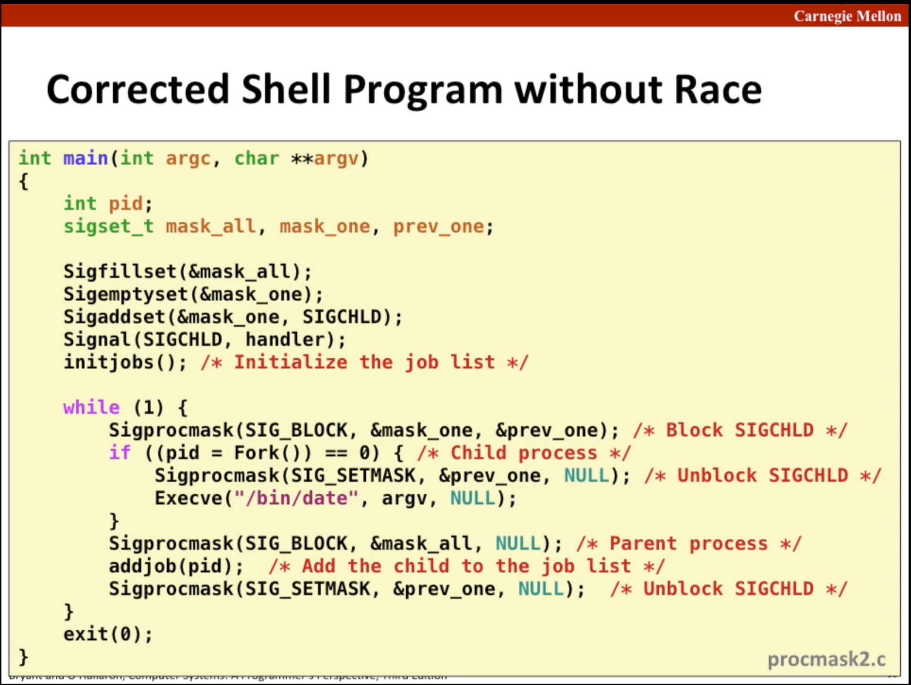
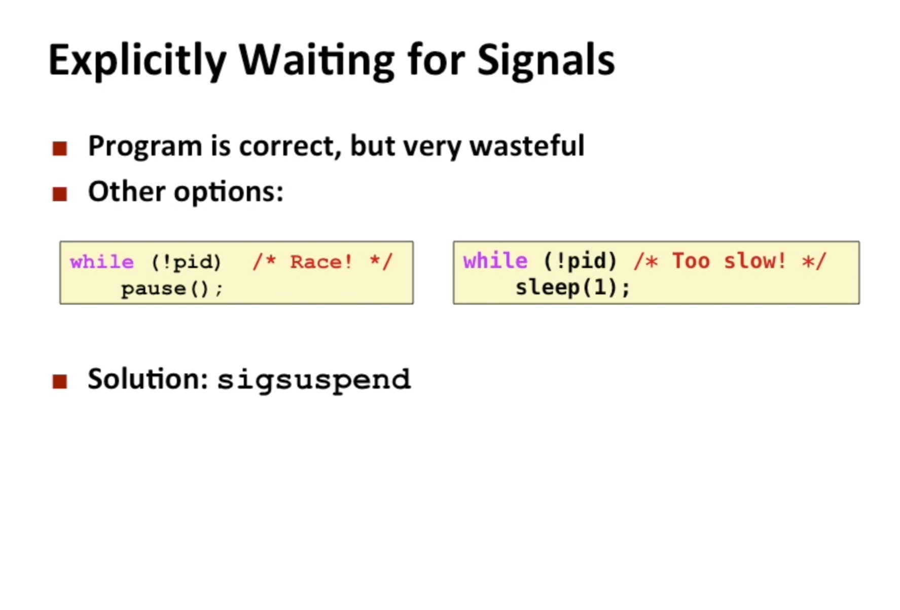
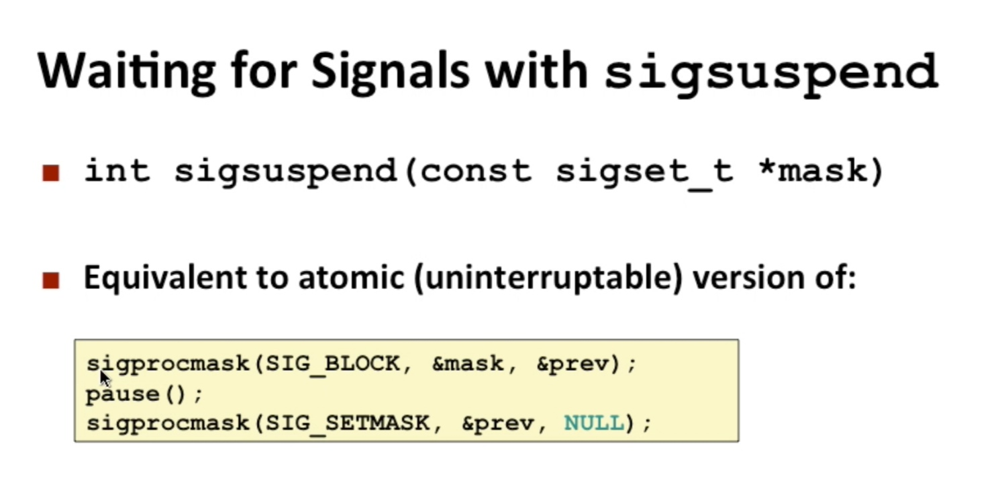

# Callee and Caller saved Registers

## Caller-Saved Registers

The caller saved registers are registers that normally always get used by a function call

These are registers that a function (callee) is free to overwrite during its execution.

They are typically used for:

- Passing arguments (`rdi`, `rsi`, `rdx`, `rcx`, `r8`, `r9`)

- Returning values (`rax`)

- Temporary computations inside the function (`r10`, `r11`)

Because the callee can use them without saving, the caller is responsible if it wants to preserve any values in these registers across the call.

## Callee-Saved Registers

These are registers that the caller expects to remain unchanged across a function call.

By default, a function (callee) does not need to use them.

If the callee does want to use one of these registers, it must save its original value (usually on the stack) and restore it before returning.

Purpose: `Allow the caller to store long-lived values in certain registers across a function call without worrying that the callee will overwrite them.`

Rule: If the callee wants to use a callee-saved register (like rbx, rbp, r12–r15):

- It must save the original value (usually by pushing it on the stack).

- It can then use the register freely.

- Before returning, it must restore the original value so the caller sees the register unchanged.

# Hex and raw:

what objdump shows(`48` `89` `e5` `90` `90`) is ascii text This is NOT what the CPU executes. This is just human-readable text representing bytes. 

Raw = actual binary bytes in memory (`0x48` `0x89` `0xE5` `0x90` `0x90`) 
Thats why when printed many show up as `���` because they dont have valid 
ascii representation for them.

# RIP and execution:

`rip` normally always points into the `.text` section

During normal (non‑overflow) execution:

- RIP points to an address in `.text`

- CPU fetches instructions from `.text`

- Executes them one-by-one (unless a jump/call/branch changes control flow 
  and takes it some other address in `.text`) 

ret is just another instruction in the .text section. 
So `rip` reaches this instruction just like any other.

what does ret do:

- ret pops a value from the stack

- That popped value must be an address in .text (normally). 
  `so ret pop a stack address and that stack address contains an address inside the .text section`

- `rip` becomes that value

- CPU continues executing in `.text`

# x86-64 instructions are self decoding

The CPU starts at the current instruction pointer(rip), reads a byte and interprets it as an opcode.

Based on the op code, the CPU knows:

- whether there are prefixes

- whether there are ModR/M byte

- whether it has SIB byte

- whether it has a displacement

- whether it has an immediate value 

- total length of the instruction, etc..

So the CPU knows exactly how many bytes belong to that instruction.

Then it moves the rip forward by that number of instructions.

So once the rip enters the buffer it knows how to execute each instruction.

# Child process termination

When a child process terminates, it becomes a zombie unitl its parent calls `wait()` (or `waitpid()`) to collect its exit status.

If a parent doesnt call `wait()`, the child remains a zombie.

## Reaping by init

If the parent process itself terminates before collecting the child's exit status, the child is adopted by `init`(PID 1) or the system's equivalent (like systemd).

`init` automatically calls `wait()` on orphaned children, so the child is reaped and removed from the process table.

### What `wait()` returns

On success:

- Returns process ID (PID) of the terminated child that was reaped. 
<pre>
pid_t pid = wait(NULL);
</pre>

On failure:

- Returns -1 and sets `errno` to indicate the error.

- Common errors:

    - `ECHILD`: No child process exist 

    - `EINTR`: Interrupted by a signal before any child terminated

#### Note: 

`wait()` will set the system's internal `errno` when it fails, even if you dont include `<errno.h>` in your program.

- `wait()` is implemented in the C library or kernel interface. It always writes to internal `errno` on failure.

- Including `<errno.h>` inly gives your program a declaration to access `errno` safely, it does not affect whether the system sees it.

# Signal Handler

A signal handler can be invoked asymchronously by the kernel, interrupting whatever code was running at the moment. This means the program could be in the middle of modifying a global state, including:

- Memory allocator (malloc/ free) data structures.

- Standard I/O buffers (stdoud, stderr)

- File descriptor tables.

**While a signal handler is running, signals of the same type being handled are blocked.**

**If a signal of other type arrives while a handler is running, the handler is interrupted and the handler for the latest signal that arrived is run. If again a new signal of different type than the current arrives while this handler is running same process is repeated**

**The kernel delivers (makes the process handle the signals) the signals from LSB to MSB in the bit vector**

## Why `exit()` is unsafe to use from signal handlers

The `exit()` function does a lot of work internally:

1. Flushes stdio buffers (`fflush(stdout)`)

    - modifies global `FILE` structures

2. Calls functions registered with `atexit()` i.e calls `atexit()` handlers

    - might run any functions, including ones that use global state or call unsafe functions.

3. Closes open files

    - updates internal file tables, which are a shared global state

If a signal interrupts a program while one of these structures is being used, calling `exit()` from the signal handler can:

- Corrupt memory structures

- Cause deadlocks 

- Lead to undefined behaviour

POSIX standard lists `exit()` as not async-signal-safe.

**`_exit()`** declared in `<unistd.h>`:

- Performs immediate process termination

Steps it does:

1. Does not flush stdio buffers

2. Does not call `atexit()` handlers

3. Does not perform normal cleanup

    - just terminates the process and returns the status to OS.

It is safe to call in contexts where normal cleanup is unsafe, like after `fork()` in the child process or in `signal_handlers`.

## **`Reentrancy` avoids shared state issues**

`printf`, `fprintf`, `sprintf`, `malloc`, `free`, `exit()`... are not safe to be used by signal handlers.

_A function is reentrant if:_

`It does not use shared mutable state (global variables, static variables, shared buffers)`,

OR

`If it does, access to that shared state is properly synchronized`,

AND

`It does not call non-reentrant/unsafe functions`.

This ensures that each invocation of the function has its own separate memory and does not intefere with other calls, including the ones interrupted by signals.

By "invocations", I mean:

1. The main program or thread that was interrupted by the signal.

2. Other signal handlers that might run if another signal arrives.

## signals are not reliable event counters

POSIX blocks the same signal type by default to avoid recursive/nested handlers, which could easily lead to:

- Stack overflow if a signal keeps interrupting itself.

- Reentrancy problems if the handler is not carefully written.

That's why signals alone are not guarenteed to be reliable counters for multiple events.

## Why errno should be saved in a signal_handler

A signal handler can be invoked asynchronously, interrupting whatever code was running. 
At that moment:

- The program may have a meaningful value in errno from some system call or library function.

- If your signal handler calls any functions that might set `errno`(like `write()`, `read()`, etc.), it will overwrite the original value.

- This can confuse the code which was originally interrupted, which may rely on the original `errno`.

So in a signal handler we should save the `errno` in a local int variable before the actual handler code starts and after the handler code is finished, write the previously saved errno state to `errno`.

# global shared variables should be declared `volatile`

If both the main subroutines and the signal handler can update the same global variable, that variable should be a `volatile` or else compiler may put the variable in a register.

**Using `volatile` tells the compiler to always read/write the variable from memory(cpu_cache, ram whatever(hardware managed)).**

Why its a problem:

- Registers are compiler managed storage. If the compiler keeps the variable in a register, it might never read updates made by a signal handler.  
main routine/subroutine catches the variable in a register while the signal handler updates memory - the main routine keeps using the old value.

# Temporarily blocking all signals to protect shared data structures

The signals should be blocked while a handler is accessing a shared data structure to protect possible corruption because:

- A signal can be delivered while the main program is executing code or another signal handler is executing. So if handler functions use the global/static variables, it might be interrupted by other handlers which may access it. So you can get inconsistent state or data races leading to undefined behaviour.

## If no increments needed global flag should be declared as `volatile sig_atomic_t`

An increment is a multi-step operation that requires a read -> modify -> write sequence not a single indivisible operation.

Why this is a problem:

Imagine main routine is doing `counter++` and a signal arrives in the middle:

- Main reads `counter = 5`

- Signal handler runs and sets say `counter = 10`

- Main continues: adds 1 -> 5+1 = 6

- Main writes 6 back to counter.

Result: The update by the signal handler is lost. The main routine overwrite it. So increment is not atomic.

**If no increment needed, `sig_atomic_T` alone is enough and there is no need to block signals**

Here's why:

- `sig_atomic_t` guarentees that a **read or write of the variable is atomic**, meaning it can't be interrupted in the middle.

- So if a signal arrives at any time, the main routine will either see the old value or the new value - never a corrupted one.

**If you truly want the value set by the handler**, you need to make the read -> write -> modify sequence atomic:

- Block signals arount the increment.  
This ensures the handler cannot run in the middle of your increment, **so you are always incrementing the latest handler value**.

# Subtle bugs

## Race between parent process and signal handlers

The parent process blocks the SIGCHILD signal before forking the child so that if the child terminates before the control reaches the lines where the parent adds the child to the job queue in the parent process, then the parent's sigchild_handler cant reap the child and remove it from the job queue before its even added to the queue by the parent.

But the SIGCHILD signal was unblocked inside the child process because:

- The child inherits the same mask as the parent after its fork.

- It can have its own children and if the SIGCHILD signal is not unblocked for it then it wont be able to handle and reap its children when they terminate.

- Unblocking the SIGCHILD signal inside the child doesn't affect the parent's blocklist ofcourse **becasue signal masks are per process**.

Then all the signals are blocked before adding the child to the job list to protect the shared job queue.

And then after the child is added, we restore the mask state which was true before we blocked the SIGCHILD before the `fork()` i.e the SIGCHILD signal unblocked and whatever the status of the rest of the signals at that time was.

## Explicit waiting in main for signals

This wastes precious cpu cycles just spinning.

we cant use `pause()` because:

- `pause()` sleeps until a new signal is delivered. And the while loop conditional is checked only after `pause()` returns.

So if `SIGCHILD` already happend before the `pause()` call (i.e right after the while loop conditional was true) then:

- The flag `pid` is set but the process still calls `pause()` (because the while loop check happened earlier).

- Now no further signals may arrive because all the children may have terminated and sigchild_handle may have reap all the terminated children.

- Sp `pause()` sleeps forever and the loop body never ends because the loop body never resumes.

_Could the user press ctrl-c and wake it then terminate the process?_

**Yes** if sigint isnt ignored, but that is an external intervention. A correct program must not depend on random signals from outside to function.

#### Important points about `pause()`

The pause() function causes the calling process to sleep until a signal is delivered that either terminates the process or **invokes a signal-catching function**.

key points:

- **Signal with a handler**: pause() returns after the handler runs and wakes the process.

- **Signal with a default acion** = terminate. 
process terminates, never returns from `pause()`.

- **Signal ignored**: if the signal is ignored, `pause()` continues sleeping - it does not wake.

- **Signal blocked**: signal becomes pending, `pause()` does not wake.

### Solution:

we have to use `sigsuspend()`. 
**Blocking and unblocking around `pause()` wont work** as:

- Blocking the signal just makes it `pending`.

- `pause()` is already executing, waiting for a signal to wake it.  
BUT,  
Signals are only delivered to wake the process if they arrive while `pause()` is sleeping and the signal is unblocked.

- Unblocking now delivers the SIGCHILD signal and the handler runs. 

- But signals that were pending before `pause()` or delivered while `blocked` do not automatically wake the already sleeping `pause()`.

`sigsuspend()` uses whatever the mask was previously so that it can sleep until a signal we desire arrives.

